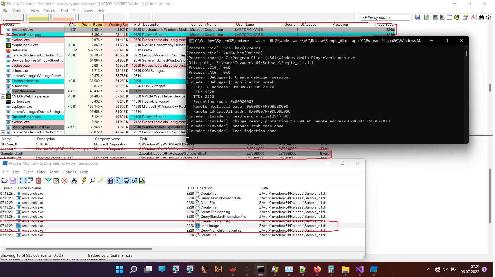
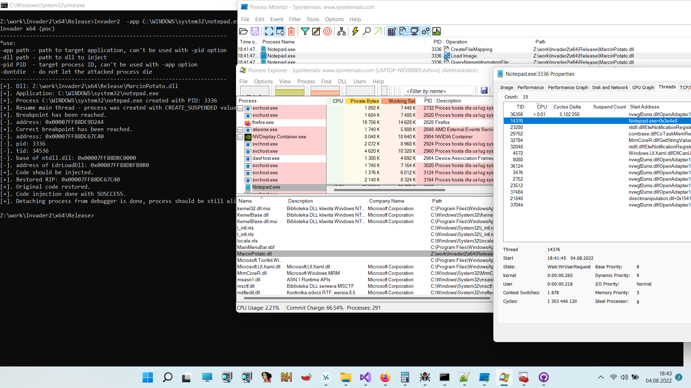
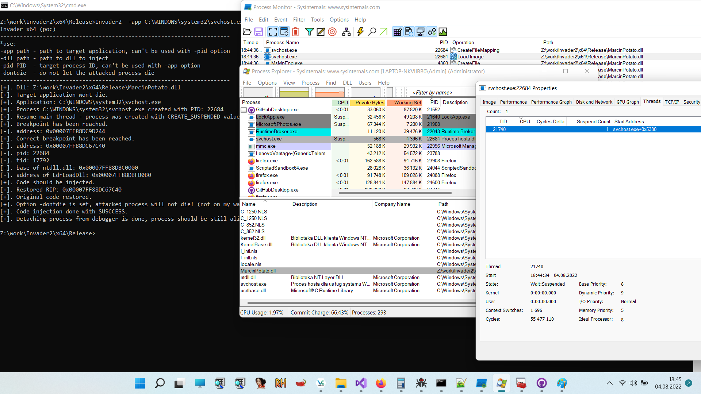

<body style="background-color:white;">

 
<pre>
              .-') _      (`-.     ('-.     _ .-') _     ('-.  _  .-')        
             ( OO ) )   _(OO  )_  ( OO ).-.( (  OO) )  _(  OO)( \( -O )       
  ,-.-') ,--./ ,--,',--(_/   ,. \ / . --. / \     .'_ (,------.,------.       
  |  |OO)|   \ |  |\\   \   /(__/ | \-.  \  ,`'--..._) |  .---'|   /`. '      
  |  |  \|    \|  | )\   \ /   /.-'-'  |  | |  |  \  ' |  |    |  /  | |      
  |  |(_/|  .     |/  \   '   /, \| |_.'  | |  |   ' |(|  '--. |  |_.' |      
 ,|  |_.'|  |\    |    \     /__) |  .-.  | |  |   / : |  .--' |  .  '.'      
(_|  |   |  | \   |     \   /     |  | |  | |  '--'  / |  `---.|  |\  \       
  `--'   `--'  `--'      `-'      `--' `--' `-------'  `------'`--' '--'      
</pre>
 
<h3>Abstrakt</h3> 
Współcześnie wykorzystanie technik DLL/Code Injection nie musi być zadaniem trywialnym,  właściwie nie trywialne może być rozbicie 
charakterystycznych łańcuchów detekcji, sekwencji wywołań,  jakie występują w tym procesie nie zależnie od tego, jaką konkretnie technikę 
wstrzykiwania kodu wybierzemy.  
W najbardziej klasycznym przypadku mamy sekwencje wywołań, która wygląda następująco:  
 
VirtualAllocEx 
VirtualProtectEx 
WriteProcessMemory 
CreateRemoteThread 
 
Niektóre z wywołań tych funkcji muszą występować w określonej kolejności inne nie koniecznie, 
a sama obecność w aplikacji takiego zbioru może podnieść współczynnik wykrywalności i sprawić, 
że zostanie ona określona, co najmniej, jako podejrzana przez systemy detekcji (AV, EDR/HIPS). 
Invader wykorzystując API debuggera systemu MS Windows może zredukować te charakterystyczne sekwencje wywołań do właściwie dwóch funkcji: 
 
VirtualProtectEx i WriteProcessMemory 
 
Kiedy podłączamy debugger do procesu to zależnie od stopnia, w jakim został utworzony taki proces, 
jego wykonanie zatrzymuje się generując wyjątek 0x80000003 (Exception Breakpoint).  
Na poziomie implementacyjnym, w systemie Windows i aplikacjach trybu użytkownika (ring-3) wykonanie kodu w procesie, 
do którego podłączany jest debugger trafia do jednej z dwóch funkcji: 
 
DbgBreakPointWithStatus - jeśli proces jest w we wczesnym stadium wykonywania (został uruchomiony przed chwilą, jest w trybie SUSPEND) - lub 
DbgBreakPoint - jeśli proces działa dłuższą chwilę. 
 
Obie te procedury realizują to samo zadanie, wywołują przerwanie INT 0x03 (EXCEPTION_BREAKPOINT), które w przypadku,  
kiedy do procesu podłączony jest debugger podobnie jak inne zdarzenia/wyjątki debuggowania będzie obsłużone przez debugger. 
Istotna różnica między DbgBreakPointWithStatus, a DbgBreakPoint jest taka,  
że ta pierwsza nie jest eksportowana przez bibliotekę ntdll.dll i trudno na jej podstawie obliczyć adres bazowy biblioteki ntdll.dll w sposób "mało hałaśliwy". 
Poza tym DbgBreakPointWithStatus zwraca wartość, a DbgBreakPoint nie. 
Kiedy w debuggowanej aplikacji występuje wyjątek, debugger otrzymuje na jego temat szereg informacji,  
w których zawarty jest między innymi adres, pod którym wyjątek wystąpił.  
Jest to jeden z kluczowych elementów tej techniki, ponieważ ten adres z naszej perspektywy to wartość wskaźnika rozkazów (RIP/EIP) w atakowanym procesie,  
którego wykonanie jest aktualnie wstrzymane przez debugger, a nad którego wykonaniem mamy relatywnie dużą kontrolę.  
Teoretycznie wystarczy, więc zmienić prawa dostępu do pamięci wskazywanej przez adres, pod którym wystąpił wyjątek,  
zapisać pod tym adresem własny kod i przywrócić wykonanie procesu.
<h5>Dlaczego EXCEPTION_BREAKPOINT?</h5>
Funkcje Dbg* z ntdll są dość rzadko wykorzystywane podczas normalnego wykonania aplikacji.  
DbgBreakPoint i DbgBreakPointWithStatus aktualnie znajdują w obszarze pliku ntdll.dll, w którym mamy stosunkowo dużo miejsca na nasz kod.  
W innych przypadkach moglibyśmy nadpisać na tyle istotne dla naszego kodu procedury, że nie mógłby on działać,  
np. gdybyśmy nadpisali fragmenty funkcji LdrLoadDll to nie moglibyśmy z niej skorzystać.  
Funkcję DbgBreakPoint możemy wywołać w zdalnym procesie na żądanie przy pomocy DebugBreakProcess.  
W przypadku innych zdarzeń niż EXCEPTION_BREAKPOINT musielibyśmy czekać aż one wystąpią same lub znaleźć sposób do ich sprowokowania,  
a następnie przeanalizować ich przydatność i wpływ na wykonanie naszego kodu.
 
 
<h3> Pros && cons </h3>
<h4>[Pros]</h4>

<ul style="list-style-type:circle">
  <li>
    W systemach x64 (64-bit) możemy załadować 64-bitowy kod do 32-bitowej aplikacji WOW64 bez konieczności wykorzystywania techniki Haven's Gate. 
	Daje nam to dodatkową warstwę ochrony, jak zapewne wiecie istnieją pewne trudności w debgowaniu 64-bitowego kodu w 32-bitowej aplikacji :).
  </li>
  <li>
    Atakowany proces jest podłączony do debuggera (dodatkowa warstwa ochrony).
  </li>
  <li>
   Redukcja łańcucha detekcji/sekwencji wywołań do VirtualProtectEx i WriteProcessMemory.
  </li>
  <li>
   Możemy atakować procesy x64 i x86 oraz WoW64.
  </li>
</ul>
<h4>[Cons]</h4>

<ul style="list-style-type:circle">
  <li>
   <s>
   Po odłączeniu debuggera istnieje duże prawdopodobieństwo, że atakowany proces zakończy działanie z błędem. 
   Zapewnienie stabilności i poprawności działania atakowanego procesu po odłączeniu debuggera może wymagać bardzo ukierunkowanych ataków,  
   a czasami może być nie możliwe.  
   Tak, więc aktualnie Invader nadaje się lepiej do tworzenia i atakowania procesów "Zombie" niż do atakowania działających w systemie normalnych aplikacji. 
   Oczywiście nic nie stoi na przeszkodzie, aby uniemożliwić zakończenie działania atakowanego procesu np. przez ustawienie wątków w tryb SUSPEND i odłączyć debugger.
  </s>
   
  Aktualna wersja jest w dużym stopniu stabilna, aczkolwiek nie mogę zagwarantować stabliności w 100% ponieważ:
    <ul>
	 <li>
	 Context Switching (wielowątkowość) - <b>częściowo rozwiązany.</b> 
	 Wykonywanie wątków w Windowsie jest oparte na kwantach czasu, priorytetach i koligacji procesorów. 
	 Teoretycznie więc, jądro może przestać wykonywać wątek który zawiera wstrzyknięty kod w niekontrolowanym przez nas momencie i zacząć wykonywać  
	 inny wątek który, np. korzysta pośrednio lub bezpośrednio z adresu pamięci który nadpisaliśmy.
	 Rozwiązaniem może być zamrożenie np. za pomocą SuspendThread wszystkich wątków poza tym który wykonuje wstrzyknięty kod i 
	 odmrożenie ich w stosowym momencie za pomocą np. ResumeThread. Jest to teoretyczne rozwiązanie którego nawet nie testowałem, bo kod korzystjący z 
	 CreateToolhelp32Snapshot i Thread32First jest brzydki i nie chce mi się go pisać.
	 </li>
	 <li>
	 Stan pamięci procesu (rejestry, stos) - <b>rozwiązany</b>. 
	 Wartości kluczowych rejestrów możemy zachować wykorzystując instrukcje PUSH/POP, PUSHFQ/POPFQ, POPAD/PUSHAD. 
	 Orginalna wartość wskaźnika rozkazów to ntdll!DbgBreakPoint więc możemy ja łatwo przywrócić.
	 </li>
	</ul>
  </li>
  <li>
   Świat nie znośni próżni, jeden zredukowany łańcuch zastępuje inny łańcuch.
  </li>
</ul>

<h3> FAQ (które sobie zadawałem) </h3>
Czy mogę zhakować lssas.exe ? 
<s>
Jeśli dysponujesz odpowiednimi uprawnieniami to prawdopodobnie tak,  
ale równie prawdopodobne jest to, iż lsass.exe po wszystkim zakończy swoją 
działalność w tragicznych okolicznościach - co może być pomocne, jeśli np. chcesz zrestartować system, a nie posiadasz stosownych uprawnień, 
ale w takim przypadku pewnie nie masz również uprawnień żeby dostać się do lassas.exe ;P.
</s>
 
Yes you can! Jeśli posiadasz odpowiednie uprawnienia w systemie ;D

<h3> Todo: </h3>
<ul>
<li>Implemntacja opcji -pid - co nastąpi zanim kur zapieje trzy razy i Marcin pojedzie na wakacje.</li>
<li>Ostateczna aktualizacja tekstu, który czytasz skoro to czytasz :|</li>
</ul>

<h3> Source code (x64 PoC) </h3>

<a href="https://github.com/4337/Invader/tree/main/Sources/" target="_blank">https://github.com/4337/Invader/tree/main/Sources/</a> 
<a href="https://4337.github.io/Invader/" target="_blank">https://4337.github.io/Invader/</a>
	
<h3>Screen</h3>
<!--

-->
 

 
	

 
 

</body>
</head>
