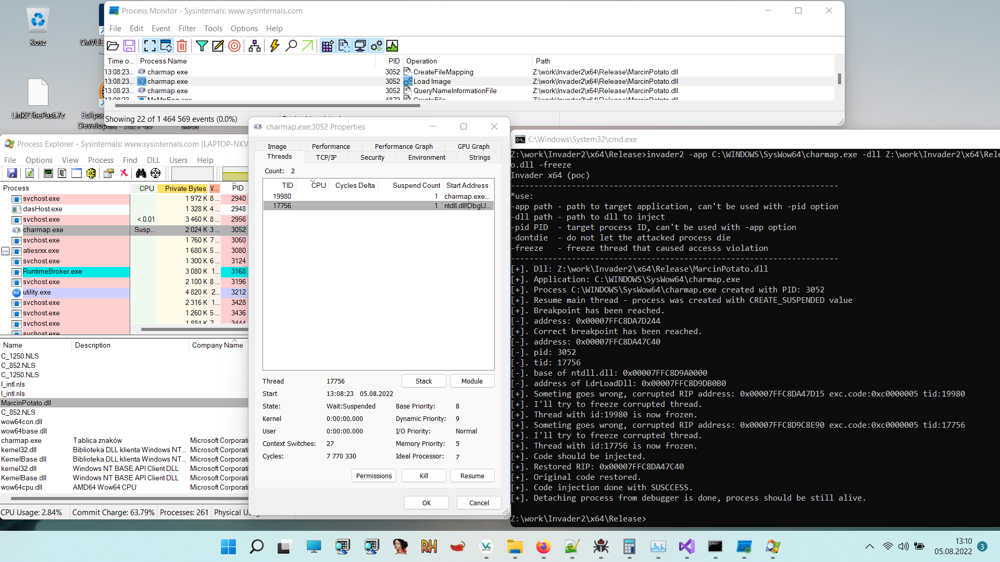
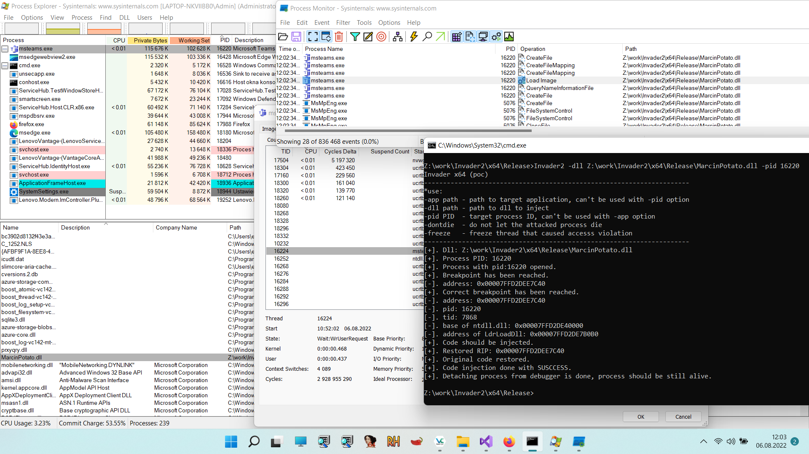

<body style="background-color:white;">

 
<pre>
              .-') _      (`-.     ('-.     _ .-') _     ('-.  _  .-')        
             ( OO ) )   _(OO  )_  ( OO ).-.( (  OO) )  _(  OO)( \( -O )       
  ,-.-') ,--./ ,--,',--(_/   ,. \ / . --. / \     .'_ (,------.,------.       
  |  |OO)|   \ |  |\\   \   /(__/ | \-.  \  ,`'--..._) |  .---'|   /`. '      
  |  |  \|    \|  | )\   \ /   /.-'-'  |  | |  |  \  ' |  |    |  /  | |      
  |  |(_/|  .     |/  \   '   /, \| |_.'  | |  |   ' |(|  '--. |  |_.' |      
 ,|  |_.'|  |\    |    \     /__) |  .-.  | |  |   / : |  .--' |  .  '.'      
(_|  |   |  | \   |     \   /     |  | |  | |  '--'  / |  `---.|  |\  \       
  `--'   `--'  `--'      `-'      `--' `--' `-------'  `------'`--' '--'      
</pre>
 
<h3>Abstrakt</h3> 
Wsp贸czenie wykorzystanie technik DLL/Code Injection nie musi by zadaniem trywialnym,  waciwie nie trywialne może by rozbicie 
charakterystycznych acuch贸w detekcji, sekwencji wywoa,  jakie wystpuj w tym procesie nie zależnie od tego, jak konkretnie technik 
wstrzykiwania kodu wybierzemy.  
W najbardziej klasycznym przypadku mamy sekwencje wywoa, kt贸ra wyglda nastpujco:  
 
VirtualAllocEx 
VirtualProtectEx 
WriteProcessMemory 
CreateRemoteThread 
 
Niekt贸re z wywoa tych funkcji musz wystpowa w okrelonej kolejnoci inne nie koniecznie, 
a sama obecno w aplikacji takiego zbioru może podnie wsp贸czynnik wykrywalnoci i sprawi, 
że zostanie ona okrelona, co najmniej, jako podejrzana przez systemy detekcji (AV, EDR/HIPS). 
Invader wykorzystujc API debuggera systemu MS Windows może zredukowa te charakterystyczne sekwencje wywoa do waciwie dw贸ch funkcji: 
 
VirtualProtectEx i WriteProcessMemory 
 
Kiedy podczamy debugger do procesu to zależnie od stopnia, w jakim zosta utworzony taki proces, 
jego wykonanie zatrzymuje si generujc wyjtek 0x80000003 (Exception Breakpoint).  
Na poziomie implementacyjnym, w systemie Windows i aplikacjach trybu użytkownika (ring-3) wykonanie kodu w procesie, 
do kt贸rego podczany jest debugger trafia do jednej z dw贸ch funkcji: 
 
DbgBreakPointWithStatus - jeli proces jest w we wczesnym stadium wykonywania (zosta uruchomiony przed chwil, jest w trybie SUSPEND) - lub 
DbgBreakPoint - jeli proces dziaa duższ chwil. 
 
Obie te procedury realizują to samo zadanie, wywołują przerwanie INT 0x03 (EXCEPTION_BREAKPOINT), które w przypadku, 
kiedy do procesu podłączony jest debugger podobnie jak inne zdarzenia/wyjątki debuggowania będzie obsłużone przez debugger.
Istotna różnica między DbgBreakPointWithStatus, a DbgBreakPoint jest taka, 
że ta pierwsza nie jest eksportowana przez bibliotekę ntdll.dll i trudno na jej podstawie obliczyć adres bazowy biblioteki ntdll.dll w sposób "mało hałaśliwy".
Poza tym DbgBreakPointWithStatus zwraca warto, a DbgBreakPoint nie. 
Kiedy w debuggowanej aplikacji wystpuje wyjtek, debugger otrzymuje na jego temat szereg informacji,  
w kt贸rych zawarty jest midzy innymi adres, pod kt贸rym wyjtek wystpi.  
Jest to jeden z kluczowych elementów tej techniki, ponieważ ten adres z naszej perspektywy to wartość wskaźnika rozkazów (RIP/EIP) w atakowanym procesie,
którego wykonanie jest aktualnie wstrzymane przez debugger, a nad którego wykonaniem mamy relatywnie dużą kontrolę. 
Teoretycznie wystarczy, więc zmienić prawa dostępu do pamięci wskazywanej przez adres, pod którym wystąpił wyjątek,
zapisać pod tym adresem własny kod i przywrócić wykonanie procesu.
<h5>Dlaczego EXCEPTION_BREAKPOINT?</h5>
Funkcje Dbg* z ntdll s do rzadko wykorzystywane podczas normalnego wykonania aplikacji.  
DbgBreakPoint aktualnie znajduje się w obszarze pliku ntdll.dll, w którym mamy stosunkowo dużo miejsca na nasz kod.
W innych przypadkach moglibyśmy nadpisać na tyle istotne dla naszego kodu procedury, że nie mógłby on działać,
np. gdybyśmy nadpisali fragmenty funkcji LdrLoadDll to nie moglibyśmy z niej skorzystać.
Funkcję DbgBreakPoint możemy wywołać w zdalnym procesie na żądanie przy pomocy DebugBreakProcess. 
W przypadku innych zdarze niż EXCEPTION_BREAKPOINT musielibymy czeka aż one wystpi same lub znale藕 spos贸b do ich sprowokowania,  
a następnie przeanalizować ich przydatność i wpływ na wykonanie naszego kodu.
 
 
<h3> Pros && cons </h3>
<h4>[Pros]</h4>

<ul style="list-style-type:circle">
  <li>
    W systemach x64 (64-bit) możemy zaadowa 64-bitowy kod do 32-bitowej aplikacji WOW64 bez koniecznoci wykorzystywania techniki Haven's Gate. 
	Daje nam to dodatkową warstwę ochrony, jak zapewne wiecie istnieją pewne trudności w debgowaniu 64-bitowego kodu w 32-bitowej aplikacji :).
  </li>
  <li>
    Atakowany proces jest podłączony do debuggera (dodatkowa warstwa ochrony).
  </li>
  <li>
   Redukcja łańcucha detekcji/sekwencji wywołań do VirtualProtectEx i WriteProcessMemory.
  </li>
  <li>
   Możemy atakować procesy x64 i x86 oraz WoW64.
  </li>
</ul>
<h4>[Cons]</h4>

<ul style="list-style-type:circle">
  <li>
   <s>
   Po odczeniu debuggera istnieje duże prawdopodobiestwo, że atakowany proces zakoczy dziaanie z bdem. 
   Zapewnienie stabilnoci i poprawnoci dziaania atakowanego procesu po odczeniu debuggera może wymaga bardzo ukierunkowanych atak贸w,  
   a czasami może by nie możliwe.  
   Tak, wic aktualnie Invader nadaje si lepiej do tworzenia i atakowania proces贸w "Zombie" niż do atakowania dziaajcych w systemie normalnych aplikacji. 
   Oczywiście nic nie stoi na przeszkodzie, aby uniemożliwić zakończenie działania atakowanego procesu np. przez ustawienie wątków w tryb SUSPEND i odłączyć debugger.
  </s>
   
  Aktualna wersja jest w dużym stopniu stabilna, aczkolwiek nie mogę zagwarantować stabliności w 100% ponieważ:
    <ul>
	 <li>
	 Context Switching (wielowtkowo) - <b>czciowo rozwizany.</b> 
	 Wykonywanie wtk贸w w Windowsie jest oparte na kwantach czasu, priorytetach i koligacji procesor贸w. 
	 Teoretycznie wic, jdro może przesta wykonywa wtek, kt贸ry zawiera wstrzyknity kod w niekontrolowanym przez nas momencie i zacz wykonywa  
	 inny wątek, który np. korzysta pośrednio lub bezpośrednio z adresu pamięci który nadpisaliśmy.
	 Rozwiązaniem może być zamrożenie np. za pomocą SuspendThread wszystkich wątków poza tym który wykonuje wstrzyknięty kod i 
	 odmrożenie ich w stosowym momencie za pomocą np. ResumeThread. Jest to teoretyczne rozwiązanie, którego nawet nie testowałem, ponieważ kod korzystjący z 
	 CreateToolhelp32Snapshot i Thread32First jest brzydki i nie chce mi się go pisać.
	  
	 Kolejny pomysł, który może przyczynić się do lepszej stabilizacji, to umieszczenie pod adresem ntdll!DbgBreakPoint, "trampoliny", skoku bezwarunkowego do 
	 kodu (stub), który zostanie umieszczony w mniej używanej przez atakowany proces lokalizacji pamięci, np. obszar funkcji startowych wskazwyany przez 
	 _IMAGE_OPTIONAL_HEADER.AddressOfEntryPoint. To znacznie zredukuje rozmiar modyfikowanego kodu biblioteki ntdll.dll.
	 </li>
	 <li>
	 Stan pamici procesu (rejestry, stos) - <b>rozwizany</b>. 
	 Wartoci kluczowych rejestr贸w możemy zachowa wykorzystujc instrukcje PUSH/POP, PUSHFQ/POPFQ, POPAD/PUSHAD. 
	 Orginalna warto wska藕nika rozkaz贸w to ntdll!DbgBreakPoint wic możemy ja atwo przywr贸ci. 
	 Zawartość stosu nie powinna zostać zmieniona/uszkodzona w wyniku wykonania wstrzykniętego kodu, ponieważ to co robimy
	 to w gruncie rzeczy zmiana zawartoci (kodu) procedury (wariant Function Hjackingu), wic wszystko jest uożone i wyr贸wnane tak jak powinno by.  
	 </li>
	</ul>
  </li>
  <li>
   Świat nie znośni próżni, jeden zredukowany łańcuch zastępuje inny łańcuch.
  </li>
</ul>

<h3> FAQ (które sobie zadawałem) </h3>
Czy mog zhakowa lssas.exe ? 
<s>
Jeli dysponujesz odpowiednimi uprawnieniami to prawdopodobnie tak,  
ale równie prawdopodobne jest to, iż lsass.exe po wszystkim zakończy swoją 
dziaalno w tragicznych okolicznociach - co może by pomocne, jeli np. chcesz zrestartowa system, a nie posiadasz stosownych uprawnie, 
ale w takim przypadku pewnie nie masz również uprawnień żeby dostać się do lassas.exe ;P.
</s>
 
Yes you can! Jeśli posiadasz odpowiednie uprawnienia w systemie ;D

<h3> Todo: </h3>
<ul>
<li>Implemntacja opcji -pid - co nastąpi zanim kur zapieje trzy razy i Marcin pojedzie na wakacje.</li>
<li>Ostateczna aktualizacja tekstu, który czytasz skoro to czytasz. 🤘</li>
<li>Destruktory i sprzątanie.</li>
</ul>

<h3> Source code (x64 PoC) </h3>

<a href="https://github.com/4337/Invader/tree/main/Sources/" target="_blank">https://github.com/4337/Invader/tree/main/Sources/</a> 
<a href="https://4337.github.io/Invader/" target="_blank">https://4337.github.io/Invader/</a>
	
<h3>Screen</h3>
<!--

-->
 

 
	
 
	
 
	

 
 

</body>
</head>
